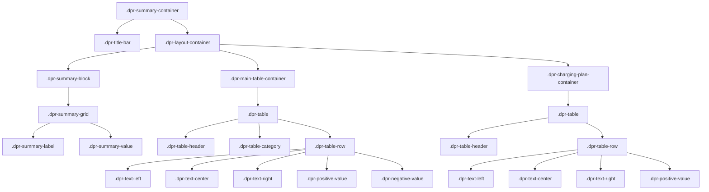

# DPR Summary Section Component Structure

## Component Hierarchy

```mermaid
graph TD
    A[DPRSummarySection] --> B[Title Bar]
    A --> C[Layout Container]
    C --> D[Summary Block]
    C --> E[Main Table Container]
    C --> F[Charging Plan Container]
    D --> G[Summary Grid]
    G --> H[Summary Label 1]
    G --> I[Summary Value 1]
    G --> J[Summary Label 2]
    G --> K[Summary Value 2]
    G --> L[Summary Label 3]
    G --> M[Summary Value 3]
    G --> N[Summary Label 4]
    G --> O[Summary Value 4]
    G --> P[Summary Label 5]
    G --> Q[Summary Value 5]
    G --> R[Summary Label 6]
    G --> S[Summary Value 6]
    G --> T[Summary Label 7]
    G --> U[Summary Value 7]
    G --> V[Summary Label 8]
    G --> W[Summary Value 8]
    G --> X[Summary Label 9]
    G --> Y[Summary Value 9]
    E --> Z[Main Activity Table]
    Z --> AA[Header Row 1]
    Z --> AB[Header Row 2]
    Z --> AC[Category Row]
    Z --> AD[Data Row 1]
    Z --> AE[Data Row 2]
    F --> AF[Charging Plan Table]
    AF --> AG[Header Row]
    AF --> AH[Data Row 1]
    AF --> AI[Data Row 2]
```

## CSS Class Structure

```mermaid
graph TD
    A[.dpr-summary-container] --> B[.dpr-title-bar]
    A --> C[.dpr-layout-container]
    C --> D[.dpr-summary-block]
    C --> E[.dpr-main-table-container]
    C --> F[.dpr-charging-plan-container]
    D --> G[.dpr-summary-grid]
    G --> H[.dpr-summary-label]
    G --> I[.dpr-summary-value]
    E --> J[.dpr-table]
    J --> K[.dpr-table-header]
    J --> L[.dpr-table-category]
    J --> M[.dpr-table-row]
    M --> N[.dpr-text-left]
    M --> O[.dpr-text-center]
    M --> P[.dpr-text-right]
    M --> Q[.dpr-positive-value]
    M --> R[.dpr-negative-value]
    F --> S[.dpr-table]
    S --> T[.dpr-table-header]
    S --> U[.dpr-table-row]
    U --> V[.dpr-text-left]
    U --> W[.dpr-text-center]
    U --> X[.dpr-text-right]
    U --> Y[.dpr-positive-value]
```